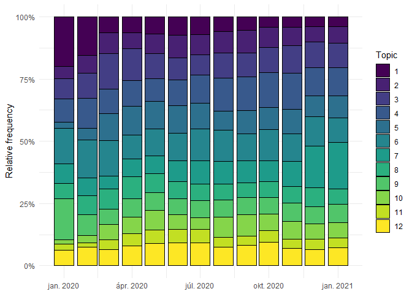
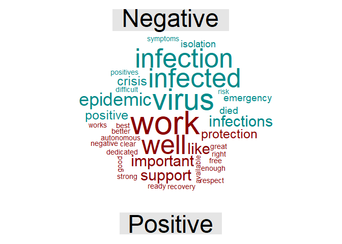
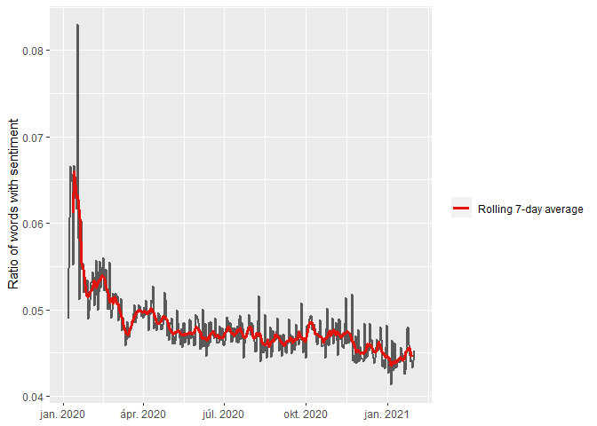
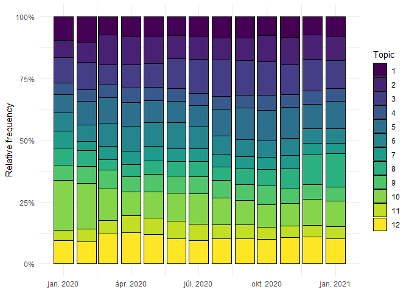
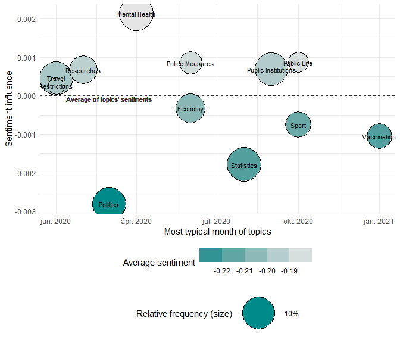
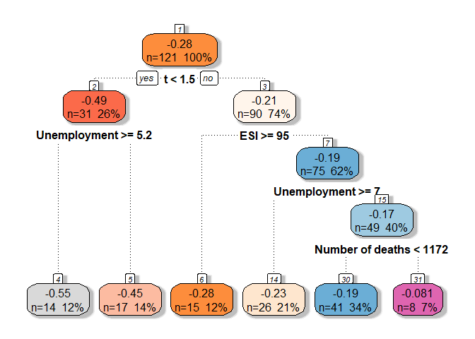
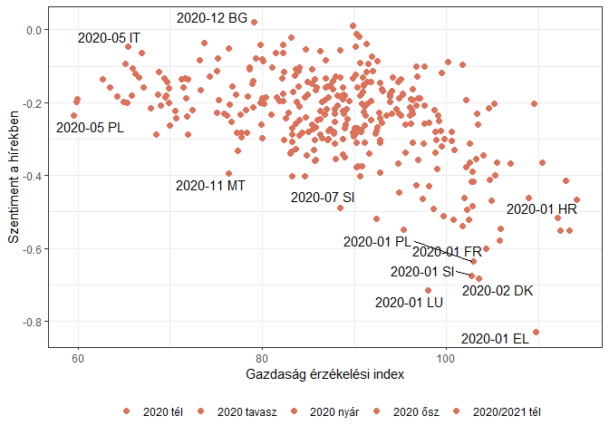

CoronaSentiment
================
Marcell P. Granát & Bálint Mazzag
2021 04 23

# Setup

``` r
# Set up --------------------------------------------------------------------------------

## Packages ============================================================================= 

library(tidyverse)
library(knitr)
library(broom)
library(geofacet)
library(tidytext)
library(tm)
library(wordcloud)
library(lubridate)
library(knitr)

ggthemr::ggthemr("greyscale")

## Working directory ====================================================================

WD <- getwd() %>% 
  gsub(pattern = "nlp-covid.*", replacement = "nlp-covid")

setwd(WD)
```

# Data

``` r
# Data ----------------------------------------------------------------------------------

# DFs from the cleaning.R file ==========================================================

dat <- list.files(str_c(WD, "/data/")) %>% 
  keep(~ str_detect(., "dat_\\d.RDS")) %>% 
  {str_c(WD, "/data/", .)} %>% 
  map(readRDS) %>% 
  reduce(rbind)

dat_sentiment_monthly <- read_rds(str_c(WD, "/data/dat_sentiment_daily.RDS")) %>% 
  select(date, country, sentiment =  new_sentiment, n = new_n, n_total = n)

dat_sentiment_monthly <- read_rds(str_c(WD, "/data/dat_sentiment_monthly.RDS")) %>% 
  select(date, country, sentiment = new_sentiment, n = new_n, n_total = n)

source(str_c(WD, "/R/data_setup.R")) # additional datasets available online

# This RData contains the articles after the main cleaning process
# To ensure full reproducibility see the attached files at the corresponding
# GitHub Repo: -> https://github.com/MarcellGranat/CoronaSentiment <-

# Topic models ==========================================================================

# Topic models calculated in -> topic_models.R <-
# moved this calculations to different files due to the large computation time
# Posterior estimation of each article with topic models is also computation heavy
# >> find the estimation in -> topics_byarticle.R <-

load(str_c(WD, "/data/topics_bydat.RData"))

### COVID-dictionary ####################################################################

# own edited sentiment dictionary calibrated to COVID articles

modified_bing <- read_delim(str_c(WD, "/data/sentiment_scores.csv"), 
    ";", escape_double = FALSE, trim_ws = TRUE) %>% 
  select(word, value = 'my_sentiment_2') %>% 
  na.omit()
```

``` r
metadata_df <- tibble::tribble(
  ~"Ország", ~"Ország kódja",            ~"Letöltött hírforrás", ~"Állami?",     ~"Nyelv",
  "Ausztria",          "AT",                    "Die Presse",            "Nem",    "német",
  "Belgium (francia)",          "BE",                          "RTBF",           "Igen",  "francia",
  "Belgium (holland)",          "BE",                           "VRT",           "Igen",  "holland",
  "Bulgária",          "BG", "Bulgarian National Television",           "Igen",   "bolgár",
  "Ciprus",          "CY",                   "Cyprus Mail",            "Nem",    "angol",
  "Csehország",          "CZ",                "Česká televize",           "Igen",     "cseh",
  "Dánia",          "DK",                     "Politiken",            "Nem",      "dán",
  "Egyesült Királyság",          "UK",                  "The Guardian",            "Nem",    "angol",
  "Észtország",          "EE",                           "ERR",           "Igen",     "észt",
  "Finnország",          "FI",                      "Yle News",           "Igen",     "finn",
  "Franciaország",          "FR",                     "France 24",           "Igen",  "francia",
  "Görögország",          "EL",                           "ERT",           "Igen",    "görög",
  "Hollandia",          "NL",                           "NOS",            "Nem",  "holland",
  "Horvátország",          "HR",                 "Večernji list",            "Nem",   "horvát",
  "Írország",          "IR",               "The Irish Times",            "Nem",    "angol",
  "Izland",          "IS",                           "RÚV",           "Igen",  "izlandi",
  "Lengyelország",          "PL",                           "TVP",           "Igen",  "lengyel",
  "Lettország",          "LV",                           "LSM",           "Igen",     "lett",
  "Litvánia",          "LT",                "LRT televizija",           "Igen",   "litván",
  "Luxemburg",          "LU",                   "L'essentiel",            "Nem",  "francia",
  "Magyarország",          "HU",                     "hirado.hu",           "Igen",   "magyar",
  "Málta",          "MT",                           "TVM",           "Igen",   "máltai",
  "Németország",          "DE",                   "DER SPIEGEL",            "Nem",    "német",
  "Norvégia",          "NO",                           "NRK",           "Igen",   "norvég",
  "Olaszország",          "IT",                 "la Repubblica",            "Nem",    "olasz",
  "Portugália",          "PT",                           "RTP",           "Igen", "portugál",
  "Románia",          "RO",                           "TVR",           "Igen",    "román",
  "Spanyolország",          "ES",                          "RTVE",           "Igen",  "spanyol",
  "Svájc",          "CH",              "SWI swissinfo.ch",            "Nem",    "angol",
  "Svédország",          "SE",                           "SVT",           "Igen",     "svéd",
  "Szlovákia",          "SK",                      "Nový Čas",            "Nem",  "szlovák",
  "Szlovénia",          "SI",                 "RTV Slovenija",           "Igen",  "szlovén"
) # TODO translate

metadata_df <- dat %>% 
  count(country) %>% 
  rename("Cikkek száma" = n) %>% 
  merge(metadata_df, by.x = "country", by.y = "Ország kódja")

metadata_df <- dat %>% 
  group_by(country) %>% 
  mutate("Kezdő dátum" = as.character(ymd(min(date))), 
         "Végdátum" = as.character(ymd(max(date)))) %>% 
  select(country, "Kezdő dátum", "Végdátum") %>% 
  unique() %>% 
  merge(metadata_df, by = "country") %>% 
  rename("Ország kódja" = country)

select(metadata_df, 'Ország', "Letöltött hírforrás", "Állami?", "Kezdő dátum", "Végdátum", "Cikkek száma") %>% 
  knitr::kable(caption = "A vizsgált 30 ország médiumainak főbb adatai",
               align = c('l', rep('c', 5)))
```

| Ország             |      Letöltött hírforrás      | Állami? | Kezdő dátum |  Végdátum  | Cikkek száma |
|:-------------------|:-----------------------------:|:-------:|:-----------:|:----------:|:------------:|
| Ausztria           |          Die Presse           |   Nem   | 2020-01-09  | 2021-01-31 |     6580     |
| Belgium (holland)  |              VRT              |  Igen   | 2020-02-04  | 2021-01-31 |    12239     |
| Belgium (francia)  |             RTBF              |  Igen   | 2020-02-04  | 2021-01-31 |    12239     |
| Bulgária           | Bulgarian National Television |  Igen   | 2020-03-07  | 2021-01-31 |     3188     |
| Svájc              |       SWI swissinfo.ch        |   Nem   | 2020-01-20  | 2021-01-31 |     1009     |
| Ciprus             |          Cyprus Mail          |   Nem   | 2020-01-20  | 2021-01-31 |     4622     |
| Csehország         |        Česká televize         |  Igen   | 2020-03-13  | 2021-01-31 |     2997     |
| Németország        |          DER SPIEGEL          |   Nem   | 2020-02-02  | 2021-01-31 |     8225     |
| Dánia              |           Politiken           |   Nem   | 2020-02-11  | 2021-01-31 |     2599     |
| Észtország         |              ERR              |  Igen   | 2020-01-14  | 2021-01-31 |     3926     |
| Görögország        |              ERT              |  Igen   | 2020-01-20  | 2021-01-31 |     1283     |
| Spanyolország      |             RTVE              |  Igen   | 2020-01-16  | 2021-01-31 |     7188     |
| Finnország         |           Yle News            |  Igen   | 2020-03-19  | 2021-01-31 |     9508     |
| Franciaország      |           France 24           |  Igen   | 2020-01-06  | 2021-01-31 |     3001     |
| Horvátország       |         Večernji list         |   Nem   | 2020-01-28  | 2021-01-31 |     8263     |
| Magyarország       |           hirado.hu           |  Igen   | 2020-01-09  | 2021-01-31 |     9063     |
| Izland             |              RÚV              |  Igen   | 2020-02-01  | 2021-01-29 |     6369     |
| Olaszország        |         la Repubblica         |   Nem   | 2020-01-11  | 2021-01-31 |    47643     |
| Litvánia           |        LRT televizija         |  Igen   | 2020-01-20  | 2021-01-30 |    10906     |
| Luxemburg          |          L’essentiel          |   Nem   | 2020-01-09  | 2021-01-31 |     1489     |
| Lettország         |              LSM              |  Igen   | 2020-02-27  | 2021-01-30 |     2671     |
| Málta              |              TVM              |  Igen   | 2020-03-13  | 2021-01-31 |     2557     |
| Hollandia          |              NOS              |   Nem   | 2020-01-09  | 2021-01-31 |     4858     |
| Norvégia           |              NRK              |  Igen   | 2020-01-06  | 2021-01-31 |     3223     |
| Lengyelország      |              TVP              |  Igen   | 2020-01-14  | 2021-01-31 |     8660     |
| Portugália         |              RTP              |  Igen   | 2020-03-10  | 2021-01-31 |    24535     |
| Románia            |              TVR              |  Igen   | 2020-02-22  | 2021-01-31 |     7646     |
| Svédország         |              SVT              |  Igen   | 2020-01-22  | 2021-01-31 |     4545     |
| Szlovénia          |         RTV Slovenija         |  Igen   | 2020-01-09  | 2021-01-31 |     2494     |
| Szlovákia          |           Nový Čas            |   Nem   | 2020-02-06  | 2021-01-31 |    14801     |
| Egyesült Királyság |         The Guardian          |   Nem   | 2020-01-18  | 2021-01-27 |     3716     |

A vizsgált 30 ország médiumainak főbb adatai

## Google translate

``` r
# Automatic translation =================================================================

st_hu <- c(stopwords::stopwords('hungarian'), "is", "ha", "hozzá", "címlapfotó",
           "illusztráció") %>% 
  {ifelse(str_starts(., "új"), NA, .)} %>% 
  na.omit()

ggpubr::ggarrange(
  Hungary_rawtext %>% 
    filter(!str_detect(words, '\\d')) %>% 
    anti_join(data.frame(words = st_hu)) %>% 
    count(words, sort = T) %>% 
    arrange(desc(n)) %>% 
    head(29) %>% 
    mutate(
      words = fct_reorder(words, n)
    ) %>% 
    ggplot() +
    aes(n, words) + 
    geom_vline(xintercept = 0) +
    geom_col(color = 'black', fill = "gray70") +
    labs(title = 'Magyarul', x = 'Előfordulási gyakoriság', y = NULL),
  dat_words_monthly %>% 
    filter(country == 'HU') %>% 
    group_by(country, words) %>% 
    summarise(n = sum(n)) %>% 
    ungroup() %>% 
    filter(!str_detect(words, '\\d')) %>% 
    anti_join(data.frame(words = c(stopwords::stopwords(), "also", "can"))) %>% 
    arrange(desc(n)) %>%
    left_join(get_sentiments("afinn"), 
              by=c("words"="word")) %>% 
    head(29) %>% 
    mutate(
      value = case_when(
        value < 0 ~ "Negatív",
        value > 0 ~ "Pozitív", 
        T ~ "Nincs"
      ),
      words = fct_reorder(words, n)
    ) %>% 
    ggplot() +
    aes(n, words, fill = value) + 
    geom_vline(xintercept = 0) +
    geom_col(color = "black") +
    labs(title = 'Fordítást követően', x = 'Előfordulási gyakoriság', y = NULL, 
         fill = "Adott szó szentimentje") +
    scale_fill_manual(values = c('red4', 'gray70', 'green')) + 
    theme(
      legend.position = 'bottom',
      legend.direction = 'horizontal'
    ), common.legend = T
)
```

    ## Error in filter(., !str_detect(words, "\\d")): object 'Hungary_rawtext' not found

``` r
dat_words_monthly %>% 
  group_by(date, words) %>% 
  summarise(n = sum(n)) %>% 
  ungroup() %>% 
  arrange(desc(n)) %>% 
  group_by(date) %>% 
  group_modify(~ mutate(.x, n = n / sum(n))) %>% 
  anti_join(data.frame(words = c(stopwords::stopwords(), "also", "can"))) %>% 
  group_modify(~ head(.x, 10)) %>%
  ggplot(aes(n, words)) + 
  geom_col(color = "black", fill = "cyan4") + 
  facet_wrap(~ date, scales = "free_y", labeller = as_labeller(function(x) str_sub(as.character(x), end = 7)))  +
  labs(x = "Szavak előfordulási aránya", y = NULL)
```

    ## Error in group_by(., date, words): object 'dat_words_monthly' not found

## The pandemic

``` r
library(ggforce)
library(glue)
library(ggtext)

dat_covid %>% 
  filter(code %in% unique(dat_sentiment_daily$country) &
           date < lubridate::ymd("2021-02-01") &
           date > lubridate::ymd("2019-12-31")
  ) %>% 
  group_by(date) %>% 
  summarise(new_cases = sum(new_cases, na.rm = T)) %>% 
  ungroup() %>% 
  merge(
    tibble(date = ymd(c("2020. január 7.", "2020. január 24.", "2020. január 30.", 
                        "2020. február 14.", "2020. március 16.", "2020. június 26.", 
                        "2020. szeptember 22.", "2020. november 23.",
                        "2020. december 21.")),
           text = c("Azonosítják az új típusú koronavírust Kínában", 
                    "Első európai eset Bordeaux-ban",
                    "A WHO nemzetközi horderejű járványügyi szükséghelyzetet hirdet ki",
                    "Első európai haláleset Franciaországban",
                    "Számos európai ország veszélyhelyzetet és lezárásokat hirdet",
                    "Az újranyitások megkezdődnek Európa nagyobb országaiban",
                    "A nyári enyhítések miatt az új fertőzések száma már a tavaszi hullámot meghaladja",
                    "A Pfizer és AstraZeneca vakcinák harmadik fázisú tesztjei publikálásra kerülnek",
                    "A Pfizer vakcina elsőként kerül elfogadásra az Európai Gyógyszerügynökség által")
    ), all = T
  ) %>% 
  tibble() %>% 
  merge(
    dat_sentiment_daily %>% 
      group_by(date) %>% 
      summarise(n_sentiment = sum(n)) %>% 
      ungroup(),
    all = T
  ) %>% 
  merge(
    tibble(date = seq.Date(from = lubridate::ymd('2019/12/31'), 
                           to = lubridate::ymd('2021/03/01'), by = "days")) %>% 
      mutate(t = row_number()), all.x = T
  ) %>% 
  tibble() %>% 
  mutate(
    new_cases = ifelse(is.na(new_cases), 0, new_cases),
    n_sentiment = ifelse(is.na(n_sentiment), 0, n_sentiment),
    new_cases = zoo::rollmean(new_cases, 7, na.pad=TRUE),
    n_sentiment = zoo::rollmean(n_sentiment, 7, na.pad=TRUE),
    n_sentiment = ifelse(is.na(n_sentiment), 0, n_sentiment),
    new_cases = ifelse(is.na(new_cases), 0, new_cases),
    date2 = ymd(ifelse(is.na(text), NA, as.character(date)))
  ) %>% 
  {
    
    ggplot(., aes(x =date, y = new_cases, color = "Napi új esetek száma")) +
      geom_hline(yintercept = 0) +
      geom_line() +
      geom_line(aes(date, n_sentiment*2, 
                    color = "Érzelmi szavak száma naponta")) + 
      scale_y_continuous(
        name = "Napi új esetek száma",
        sec.axis = sec_axis(~./2, name="Érzelmi szavak száma naponta")
      ) + 
      geom_mark_circle(data = filter(., !is.na(text)), aes(x=date, y = n_sentiment, description = glue('"{text}"'),
                                                           label = glue("{date}:"), group = date), color = NA, 
                       expand = unit(2, "mm"), label.family = c("Oswald", "Poppins"), 
                       label.fontsize = 6,
                       label.buffer = unit(5, "mm"), con.size = 0.2) +
      labs(x = NULL, color = NULL) + 
      theme(
        legend.position = 'bottom'
      )
  }
```

    ## Error: Problem with `filter()` input `..1`.
    ## x object 'dat_sentiment_daily' not found
    ## i Input `..1` is `&...`.

# Text analysis

## Sentiment

``` r
readxl::read_excel("C:/rprojects/CoronaSentiment/bing_to_score.xlsx") %>% 
  janitor::clean_names() %>% 
  filter(sentiment != my_sentiment) %>% 
  arrange(desc(n)) %>% 
  mutate(my_sentiment = ifelse(my_sentiment == "NA", 0, my_sentiment)) %>% 
  select(word, n, sentiment, my_sentiment) %>% 
  head(23) %>% 
  kable(caption = "A leggyakoribb olyan szavak a korpuszban, melyek pontszámát megváltoztattuk a koronavírus-specifikus szótárban", col.names = c("Szó", "Gyakoriság", "Régi szentiment", "új szentiment"))
```

| Szó         | Gyakoriság | Régi szentiment | új szentiment |
|:------------|-----------:|----------------:|:--------------|
| positive    |      80778 |               1 | -1            |
| trump       |      29681 |               1 | 0             |
| negative    |      25899 |              -1 | 1             |
| patient     |      22501 |               1 | -1            |
| significant |      15156 |               1 | -1            |
| fall        |      12073 |              -1 | 1             |
| rapid       |      11753 |               1 | -1            |
| fell        |      10968 |              -1 | 1             |
| decline     |      10752 |              -1 | 1             |
| positives   |      10751 |               1 | -1            |
| vice        |       8370 |              -1 | 0             |
| fans        |       7820 |               1 | -1            |
| exceeded    |       7073 |               1 | -1            |
| fallen      |       5221 |              -1 | 1             |
| sharp       |       3830 |               1 | -1            |
| falling     |       3774 |              -1 | 1             |
| tough       |       3382 |               1 | -1            |
| exceed      |       3343 |               1 | -1            |
| defeat      |       3267 |               1 | -1            |
| falls       |       2984 |              -1 | 1             |
| declining   |       2855 |              -1 | 1             |
| exceeds     |       2300 |               1 | -1            |
| tougher     |       1661 |               1 | -1            |

A leggyakoribb olyan szavak a korpuszban, melyek pontszámát
megváltoztattuk a koronavírus-specifikus szótárban

``` r
library(reshape2)

dat_words_monthly %>% 
  group_by(country, words) %>% 
  summarise(n = sum(n)) %>% 
  ungroup() %>% 
  filter(!str_detect(words, '\\d')) %>% 
  anti_join(data.frame(words = c(stopwords::stopwords(), "also", "can"))) %>% 
  arrange(desc(n)) %>%
  left_join(get_sentiments("afinn"), 
            by=c("words"="word")) %>% 
  mutate(
    sentiment = ifelse(value > 0, "Pozitív", "Negatív")
  ) %>% 
  na.omit() %>% 
  arrange(desc(n)) %>% 
  group_by(sentiment) %>% 
  group_modify(~ head(.x, 50)) %>% 
  ungroup() %>% 
  acast(words ~ sentiment, value.var = "n", fill = 0) %>%
  comparison.cloud(colors = c("cyan4", "red4"),
                   max.words = 100)
```

    ## Error in group_by(., country, words): object 'dat_words_monthly' not found

``` r
library(ggraph)
library(igraph)

set.seed(2021)

f_colorise <- function(x) {
  pos <- modified_bing %>% 
    filter(value == 1) %>% 
    pull(word)
  neg <- modified_bing %>% 
    filter(value == -1) %>% 
    pull(word)
  case_when(
    x %in% pos ~ 'pozitív',
    x %in% neg ~ 'negatív',
    T ~ 'neutrális'
  )
}

dat %>% 
  {.[sample(nrow(.)), ]} %>% 
  group_by(country) %>% 
  group_modify(~head(.x, 100)) %>% # TODO increase
  ungroup() %>% 
  mutate(r = row_number()) %>% 
  select(r, text) %>% 
  unnest_tokens(words, text) %>% 
  anti_join(data.frame(words = c(stopwords::stopwords(), "also", "can"))) %>% 
  count(r, words, sort = T) %>% 
  group_by(words) %>%
  filter(n() >= 20) %>%
  widyr::pairwise_cor(words, r, sort = TRUE) %>% 
  filter(item1 %in% modified_bing$word) %>% 
  head(100) %>% 
  graph_from_data_frame() %>%
  ggraph(layout = "fr") +
  geom_edge_link(aes(edge_alpha = correlation), show.legend = FALSE) +
  geom_node_point(aes(color = f_colorise(name)), size = 5, shape = 16) +
  geom_node_text(aes(label = name), repel = TRUE) +
  theme_void() + 
  labs(color = 'Szentiment')
```

    ## Error: Unknown colour name: negatĂ­v

<div class="figure" style="text-align: center">


<p class="caption">
Szentimenttel bíró szavakkal korreláló szavak hálója
</p>

</div>

``` r
dat_sentiment_daily %>% 
  group_by(date) %>% 
  summarise_at(c('n_total', 'n'), .funs = function(x) sum(x, na.rm = T)) %>% 
  ggplot(aes(date, n/n_total)) +
  geom_line(color = '#595959', size = .8) +
  geom_line(aes(date, zoo::rollmean(n/n_total, 7, na.pad=TRUE), 
                color = '7 napos mozgóátlag'), size = 1.3) +
  scale_color_manual(values = c('#E3120B')) + 
  labs(x = NULL, y = 'Szentimenttel rendelkező szavak aránya', color = NULL)
```

    ## Error in group_by(., date): object 'dat_sentiment_daily' not found

``` r
# Explore the data ----------------------------------------------------------------------

dat_sentiment_daily %>% 
  mutate(code = country) %>% 
  ggplot(aes(date, sentiment)) +
  geom_hline(yintercept = 0, color = "grey20") +
  geom_line(size = .3, color = 'grey50') +
  geom_smooth(size = 1.5, se = F) +
  facet_geo(~ code, grid = mygrid, label = 'name') +
  scale_x_date(limits = c(min(dat_sentiment_daily$date), max(dat_sentiment_daily$date)),
               breaks = c(min(dat_sentiment_daily$date), max(dat_sentiment_daily$date))) +
  labs(y = "Szentiment", x = NULL)
```

    ## Error in mutate(., code = country): object 'dat_sentiment_daily' not found

## TF-IDF

``` r
dat_words_monthly %>% 
  filter(words != "feff") %>% 
  mutate(month = ifelse(year(date)>2020,month(date)+12, month(date))) %>% 
  group_by(month, words) %>% 
  summarise(monthly_n = sum(n)) %>% 
  bind_tf_idf(words, month, monthly_n) %>%
  arrange(desc(tf_idf)) %>% 
  ungroup() %>% 
  filter(!(words %in% c(stopwords("english"), "also", "one", "will", "although"))) %>% 
  filter(!str_detect(words, "[0-9,]+")) %>% 
  filter(str_detect(words, "^[A-Za-z]+$")) %>% 
  filter(!str_detect(words, "serif")) %>% 
  filter(!(words %in% (dat_words_monthly %>% # filter words from ONE country
                         group_by(words) %>% 
                         mutate(nr_country = n_distinct(country))  %>% 
                         ungroup() %>% 
                         filter(nr_country < 3) %>% 
                         pull(words)))) %>% 
  filter(tf >0.00005) %>% 
  group_by(month) %>%
  slice_max(tf_idf, n = 3) %>%
  ungroup() %>%
  mutate(month = as.factor(month),
         words = reorder_within(words, tf_idf, month)
  ) %>% 
  ggplot(aes(tf_idf, y = words, fill = month)) +
  geom_vline(xintercept = 0) +
  geom_col(show.legend = F, color = 'black') +
  scale_y_discrete(label = function(x) gsub('__.*', '', x)) +
  
  scale_fill_hue(h = c(200, 300)) +
  scale_x_continuous(breaks = c(0, 0.00005, 0.0001), limits = c(0, 0.0001), 
                     expand = c(0, 0)) +
  facet_wrap(~month, ncol = 3, scales = "free_y", labeller = as_labeller(function(x) {
    c(paste0('2020-', 1:12), '2021-01')[as.numeric(x)]
  })
  ) +
  labs(x = "TF-IDF", y = NULL)
```

    ## Error in filter(., words != "feff"): object 'dat_words_monthly' not found

## Topic model

``` r
topic_models <- tibble(n_topic = c(2:14, 16)) %>% # number 15 is missing
  mutate(
    file_name = str_c(WD, '/data/topic_models/mod', n_topic, '.RData'),
    model = map(file_name, function(x) {load(x); return(mod)}), # <<
    # each RData contains one LDA model named as mod
    loglike = map_dbl(model, topicmodels::logLik) # find optimal number of topics
  )

ggplot(topic_models, aes(n_topic, loglike)) + 
  geom_line() + 
  labs(x = 'Topikok száma', y = 'Loglikelihood')
```

<div class="figure" style="text-align: center">


<p class="caption">
Finding the optimal number of topics for modelling
</p>

</div>

``` r
mod_topic <- topic_models[["model"]][[11]]
```

``` r
tidy(mod_topic, matrix = "beta") %>%
  anti_join(rename(stop_words, term = word)) %>% 
  group_by(topic) %>%
  top_n(20, beta) %>%
  ungroup() %>%
  arrange(topic, -beta) %>%
  mutate(term = reorder_within(term, beta, topic)) %>%
  ggplot(aes(beta, term)) +
  geom_vline(xintercept = 0) +
  geom_col(show.legend = FALSE, color = 'black', fill = 'cyan4') +
  facet_wrap(~ topic, scales = "free_y", ncol = 3, labeller = as_labeller(
    function(x) paste('Topik', x)
  )) +
  scale_y_reordered() + 
  labs(x = expression(beta), y = NULL)
```

<div class="figure" style="text-align: center">


<p class="caption">
Leggyakoribb szavak topikonként
</p>

</div>

``` r
tidy(mod_topic, matrix = "beta") %>% # unreported
  anti_join(rename(stop_words, term = word)) %>% 
  group_by(topic) %>%
  top_n(20, beta) %>%
  group_modify(.f = ~ tibble(terms = str_c(.x$term, collapse = ", "))) %>% 
  ungroup() %>% 
  kable(caption= "Leggyakoribb szavak topikonként", align = c("c", "l"))
```

| topic | terms                                                                                                                                                                                        |
|:-----:|:---------------------------------------------------------------------------------------------------------------------------------------------------------------------------------------------|
|   1   | percent, people, coronavirus, covid, 19, virus, infected, health, corona, infection, tests, time, symptoms, test, data, disease, spread, research, risk, study                               |
|   2   | people, covid, 19, government, health, social, republic, minister, public, czech, time, information, measures, days, emergency, law, ministry, protection, situation, added                  |
|   3   | people, coronavirus, covid, 19, infections, infected, health, patients, hospital, day, infection, deaths, tests, total, positive, 24, reported, hours, confirmed, died                       |
|   4   | 2020, coronavirus, church, covid, 19, home, virus, hospital, day, positive, time, days, film, tested, world, family, woman, house, video, wife                                               |
|   5   | people, coronavirus, covid, 19, home, schools, care, infected, school, health, patients, hospital, children, infection, students, employees, medical, staff, hospitals, situation            |
|   6   | percent, coronavirus, government, billion, companies, crisis, countries, time, million, pandemic, european, support, euros, market, eu, economy, economic, company, due, financial           |
|   7   | people, covid, 19, home, government, health, social, cent, masks, public, pandemic, workers, swiss, week, switzerland, link, it’s, lockdown, ireland, told                                   |
|   8   | people, coronavirus, vaccine, covid, 19, trump, virus, donald, vaccines, health, vaccination, china, president, million, doses, pandemic, european, vaccinated, united, world                |
|   9   | 1, coronavirus, league, corona, madrid, time, football, pandemic, games, season, world, start, players, announced, de, team, due, sports, french, france                                     |
|  10   | people, coronavirus, virus, government, health, country, minister, countries, restrictions, measures, days, italy, travel, border, spread, quarantine, announced, prime, authorities, closed |
|  11   | people, coronavirus, health, corona, social, country, crisis, countries, president, million, pandemic, media, city, police, world, court, authorities, due, political, security              |
|  12   | people, home, day, crisis, time, pandemic, days, life, world, family, situation, live, lot, weeks, feel, hope, moment, times, difficult, understand                                          |

Leggyakoribb szavak topikonként

``` r
dat_topics %>% 
  mutate(date = ym(str_sub(as.character(date), end = -4))) %>% 
  group_by(date, country) %>% 
  summarise_all(.funs = function(x)  mean(x, na.rm = T)) %>% 
  ungroup() %>% 
  select(date, starts_with('topic')) %>% 
  group_by(date) %>% 
  summarise_all(.funs = function(x)  mean(x, na.rm = T)) %>% 
  ungroup() %>% 
  pivot_longer(-1) %>% 
  mutate(name = factor(str_remove_all(name, 'topic_'), levels = as.character(1:12),
                       ordered = T)) %>% 
  ggplot() +
  aes(date, value, fill = name) +
  geom_col(color = 'black') + 
  labs(x = NULL, y = 'Relatív gyakoriság', fill = 'Topik') + 
  scale_y_continuous(labels = scales::percent) + 
  theme_minimal() +
  theme(
    legend.position = 'right',
    legend.direction = 'vertical'
  )
```

<div class="figure" style="text-align: center">


<p class="caption">
Topikok relatív megoszlásának időbeni dinamikája
</p>

</div>

``` r
topic_descript_df <- tibble( 
  topic = c("Kutatások", "Politika", "Statisztikák", "Közélet", "Intézmények", "Gazdaság",
            "Lezárások", "Oltások", "Sport", "Utazás", "Rendőrségi intézkedések", "Mentálhigiénia"),
  n = dat_topics %>% 
    select(country, starts_with('topic')) %>% 
    group_by(country) %>% 
    summarise_all(.funs = function(x) mean(x, na.rm = T)) %>% 
    ungroup() %>% 
    select(-country) %>% 
    apply(2, mean),
  date = dat_topics %>% 
    select(country, date, starts_with('topic')) %>% 
    mutate(date = ym(str_sub(as.character(date), end = -4))) %>% 
    group_by(country, date) %>% 
    summarise_all(.funs = function(x) mean(x, na.rm = T)) %>% 
    ungroup() %>% 
    select(-country) %>% 
    group_by(date) %>% 
    summarise_all(.funs = function(x) mean(x, na.rm = T)) %>% 
    {
      apply(.[2:13], 2, function(x) {
        as.character(.$date)[which.max(x)]
      })
    } %>% 
    ymd(),
  sentiment = dat_topics %>% 
    select(country, sentiment, n_sentiment, top_topic) %>% 
    na.omit() %>% 
    group_by(country, top_topic) %>% 
    summarise(sentiment = weighted.mean(x = sentiment,
                                        w = n_sentiment,
    )) %>% 
    ungroup() %>% 
    group_by(top_topic) %>% 
    summarise(sentiment = mean(sentiment)) %>% 
    arrange(desc(topic)) %>% 
    .$sentiment
) %>% 
  arrange(desc(n))

ggplot(data = topic_descript_df) +
  geom_hline(aes(yintercept = 0), linetype = 2, color = 'grey20') +
  geom_point(aes(x = date, y = (sentiment-mean(sentiment))*n, fill = sentiment, size = n)) +
  scale_size(range = c(10, 20), breaks = c(.1), 
             labels = function(x) scales::percent(x, accuracy = 1, decimal.mark = ',')) + # TODO
  scale_fill_gradient(low = 'cyan4', high = 'grey90', guide = guide_colorsteps()) +
  geom_text(mapping = aes(x = date, y = (sentiment-mean(sentiment))*n, label = topic), 
            show.legend = F, size = 3) + 
  geom_text(mapping = aes(x = ymd('2020-03-01'), y = -.00008), 
            color = 'grey20', size = 3,
            label = 'Topikok szentimentjének átlaga') +
  labs(x = 'Topik legjellemzőbb hónapja', y = 'Szentiment befolyás',
       fill = 'Átlagos szentiment', size = 'Relatív gyakoriság (méret)') +
  theme_minimal() + 
  theme(
    legend.position = 'bottom',
    legend.box = "vertical",
    legend.key.width = unit(1, 'cm')
  )
```

<div class="figure" style="text-align: center">


<p class="caption">
Topikok jellemzése szentiment, dátum és gyakoriság szerint
</p>

</div>

# Econometrics

## Descriptive statistics

``` r
dat_plm <- dat_eco_sent %>% 
  filter(indic == "BS-ESI-I") %>% 
  select(date = time, code = geo, eco = values) %>% 
  merge(mutate(dat_sentiment_monthly, code = country), all = T) %>% 
  merge(dat_unemployment, all = T) %>% 
  merge(dat_covid_monthly, all = T) %>% 
  mutate(
    t = lubridate::interval(lubridate::ymd('2020-01-01'), date),
    t = lubridate::as.period(t) %/% months(1),
    cases = ifelse(is.na(cases), 0, cases),
    death = ifelse(is.na(death), 0, death),
    new_cases = ifelse(is.na(new_cases), 0, new_cases),
    new_deaths = ifelse(is.na(new_deaths), 0, new_deaths)
  ) %>% 
  select(-country, -n) %>% 
  pivot_longer(-c(1:2)) %>% 
  {
    rbind(.,
          mutate(., 
                 name = paste0(name, '_l'),
                 date = date %m+% months(1)
          )
    )
  } %>%
  pivot_wider(names_from = name, values_from = value) %>% 
  mutate(
    cases_l = ifelse(is.na(cases_l), 0, cases_l),
    death_l = ifelse(is.na(death_l), 0, death_l)
  ) %>% 
  mutate(t_2 = t*t) %>% 
  mutate(
    season = case_when(
      date < ymd('2020-03-01') ~ '2020 tél',
      date < ymd('2020-06-01') ~ '2020 tavasz',
      date < ymd('2020-09-01') ~ '2020 nyár',
      date < ymd('2020-12-01') ~ '2020 ősz',
      T ~ '2020/2021 tél'
    ),
    season = factor(season, levels = c('2020 tél', '2020 tavasz', '2020 nyár', '2020 ősz',
                                       '2020/2021 tél'))
  ) %>% 
  filter(!is.na(sentiment)) %>% 
  select(code, date, everything())
```

``` r
# Regression tree -----------------------------------------------------------------------
dat_plm %>% 
  select(sentiment, eco, unemployment, cases, death, new_cases, new_deaths, t) %>% 
  set_names('Szentiment', 'ESI', 'Munkanélküliség', 'Esetszám (ezer főre eső)', 'Elhunytak száma (ezer főre eső)',
            'Esetszám', 'Elhunytak száma', 't') %>% 
  rpart::rpart(formula = Szentiment ~.,
               cp = .012) %>% 
  rattle::fancyRpartPlot(palettes = 'PuRd', sub = NULL)
```

<div class="figure" style="text-align: center">


<p class="caption">
Regressziós fa
</p>

</div>

``` r
dat_plm %>% 
  mutate(
    date = str_sub(as.character(date), end = -4)
  ) %>% 
  ggplot(aes(eco, sentiment, fill = season, label = paste(date, code))) + 
  geom_point(size = 2) +
  ggrepel::geom_text_repel(max.overlaps = 5) +
  theme_bw() + 
  theme(legend.position = 'bottom') +
  scale_fill_brewer(palette = "Dark2") +
  labs(x = 'Gazdaság érzékelési index', y = 'Szentiment a hírekben', fill = NULL)
```

<div class="figure" style="text-align: center">


<p class="caption">
A hírekben megjelenő szentiment és gazdaság érzékelési index közötti
kapcsolat
</p>

</div>

## Panel models

``` r
panel_models <- tibble(
  formula = c(
    "sentiment ~ death + eco",
    "sentiment ~ death + eco + season + death:t"
  )
) %>% 
  mutate(
    pooling = map(formula, ~ plm::plm(data = dat_plm, formula = eval(.), model = "pooling")),
    within = map(formula, ~ plm::plm(data = dat_plm, formula = eval(.), model = "within")),
    # random model cannot be estimated
    pooltest_pvalue = pmap(list(pooling, within), plm::pooltest),
    pooltest_pvalue = map_dbl(pooltest_pvalue, "p.value"),
    r_within = map_dbl(within, plm::r.squared, dfcor = T)
  )

knitr::kable(select(panel_models, -pooling, -within))
```

| formula                                     | pooltest_pvalue |  r_within |
|:--------------------------------------------|----------------:|----------:|
| sentiment \~ death + eco                    |               0 | 0.2670211 |
| sentiment \~ death + eco + season + death:t |               0 | 0.6563689 |

``` r
pwalk(list(model = pull(panel_models, within), 
           title = c("Regressziós eredmények időszakra való kontrollálás nélkül", 
                     "Becsült regresszió paraméterek kontrollálva az időszakokra")), 
      function(model, title) {
        tidy(model) %>% 
          kable(caption = title) %>% 
          print()
      })
```

| term  |   estimate | std.error |  statistic | p.value |
|:------|-----------:|----------:|-----------:|--------:|
| death |  0.2141993 | 0.0440131 |   4.866721 | 1.8e-06 |
| eco   | -0.0056132 | 0.0005184 | -10.828266 | 0.0e+00 |

Regressziós eredmények időszakra való kontrollálás nélkül

| term                |   estimate | std.error | statistic |   p.value |
|:--------------------|-----------:|----------:|----------:|----------:|
| death               | -0.2044546 | 0.1145339 | -1.785101 | 0.0752289 |
| eco                 | -0.0015587 | 0.0004901 | -3.180538 | 0.0016198 |
| season2020 tavasz   |  0.2724408 | 0.0163202 | 16.693443 | 0.0000000 |
| season2020 nyár     |  0.2358439 | 0.0153714 | 15.343064 | 0.0000000 |
| season2020 ősz      |  0.2306219 | 0.0141736 | 16.271212 | 0.0000000 |
| season2020/2021 tél |  0.2558671 | 0.0182536 | 14.017338 | 0.0000000 |
| death:t             |  0.0284812 | 0.0118543 |  2.402600 | 0.0168705 |

Becsült regresszió paraméterek kontrollálva az időszakokra
