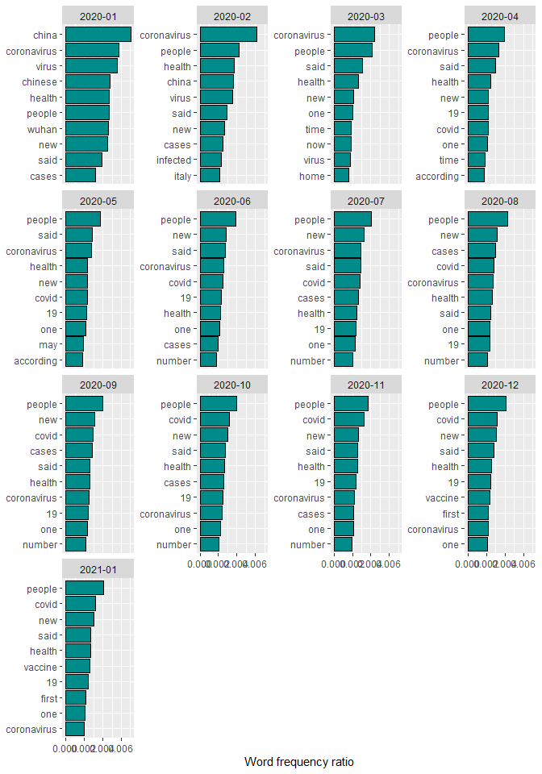
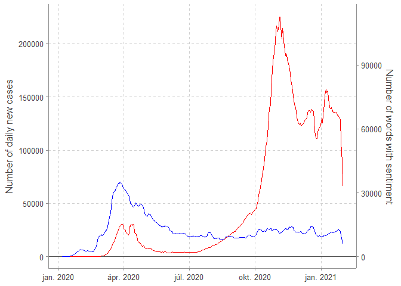
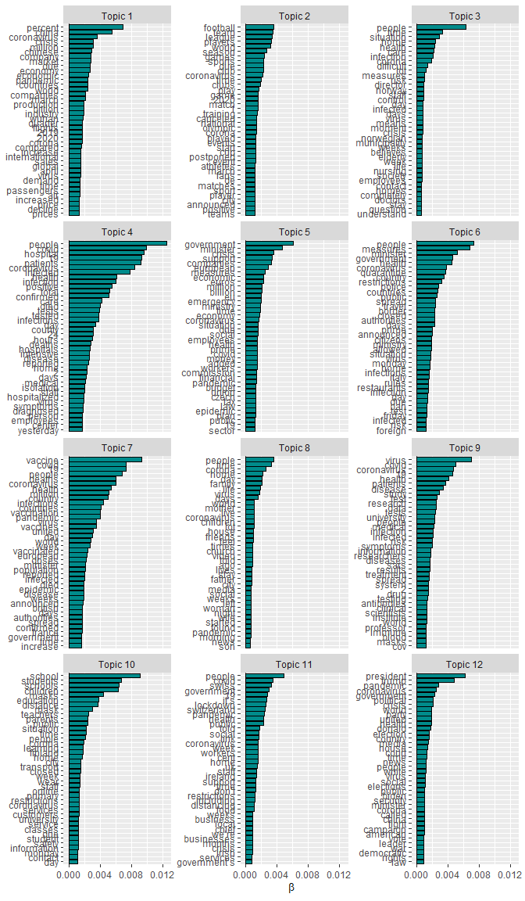
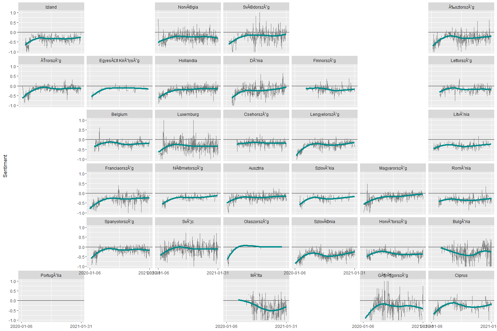
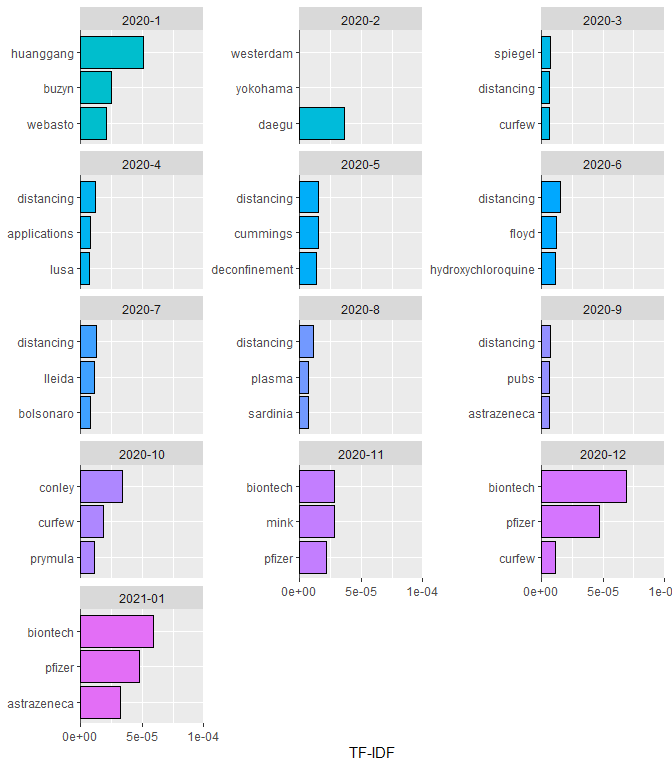
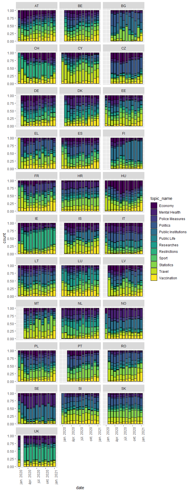
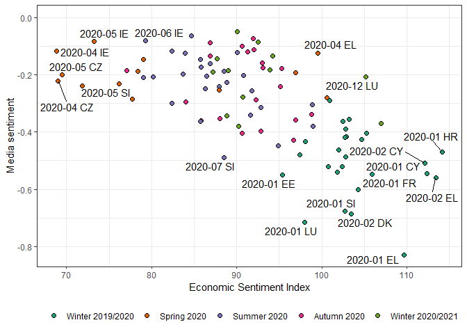

CoronaSentiment
================
Marcell P. Granát & Bálint Mazzag
2021 04 23

# Setup

``` r
# Set up --------------------------------------------------------------------------------

## Packages ============================================================================= 

library(tidyverse)
library(knitr)
library(broom)
library(geofacet)
library(tidytext)
library(tm)
library(wordcloud)
library(lubridate)
library(knitr)

ggthemr::ggthemr("greyscale")

## Working directory ====================================================================

WD <- getwd() %>% 
  gsub(pattern = "nlp-covid.*", replacement = "nlp-covid")

setwd(WD)
```

# Data

``` r
# Data ----------------------------------------------------------------------------------

# DFs from the cleaning.R file ==========================================================

dat_words_monthly <- read_rds(str_c(WD, "/data/dat_words_monthly.rds"))

source(str_c(WD, "/R/data_setup.R")) # additional datasets available online

# This RData contains the articles after the main cleaning process
# To ensure full reproducibility see the attached files at the corresponding
# GitHub Repo: -> https://github.com/MarcellGranat/CoronaSentiment <-

# Topic models ==========================================================================

# Topic models calculated in -> topic_models.R <-
# moved this calculations to different files due to the large computation time
# Posterior estimation of each article with topic models is also computation heavy
# >> find the estimation in -> topics_byarticle.R <-


load(str_c(WD, "/data/topics_bydat.RData"))
load(str_c(WD, "/data/raw/Germany_rawtext.RData"))
load(str_c(WD, "/data/sentiment_scores_results.RData"))

### COVID-dictionary ####################################################################

# own edited sentiment dictionary calibrated to COVID articles

topic_name <- tibble(
  topic = 1:12, topic_name = c(
    "Researches", "Politics", "Statistics", "Public Life", "Public Institutions", 
    "Economy", "Restrictions", "Vaccination", "Sport", "Travel", "Police Measures", 
    "Mental Health"
  )
)

sent_dictionary <- read.csv(str_c(WD, "/data/modified_sentiment_dictionary.csv"), sep = ";") %>% 
  tibble() %>% 
  select(-X) %>% 
  pivot_longer(-1) %>% 
  set_names("word", "topic_name", "sent") %>% 
  mutate(topic_name = str_replace_all(topic_name, "[.]", " ")) %>% 
  left_join(topic_name)
```

``` r
metadata_df <- tibble::tribble(
  ~"Country", ~"Country code",            ~"Media outlet", ~"State-financed",     ~"Language",
  "Austria",          "AT",                    "Die Presse",            "No",    "German",
  "Belgium (French)",          "BE",                          "RTBF",           "Yes",  "French",
  "Belgium (Dutch)",          "BE",                           "VRT",           "Yes",  "Dutch",
  "Bulgaria",          "BG", "Bulgarian National Television",           "Yes",   "Bulgarian",
  "Cyprus",          "CY",                   "Cyprus Mail",            "No",    "English",
  "Czech Republic",          "CZ",                "Česká televize",           "Yes",     "Czech",
  "Denmark",          "DK",                     "Politiken",            "No",      "Danish",
  "United Kingdom",          "UK",                  "The Guardian",            "Nem",    "English",
  "Estonia",          "EE",                           "ERR",           "Yes",     "Estonian",
  "Finland",          "FI",                      "Yle News",           "Yes",     "Finnish",
  "France",          "FR",                     "France 24",           "Yes",  "French",
  "Greece",          "EL",                           "ERT",           "Yes",    "Greek",
  "Netherlands",          "NL",                           "NOS",            "No",  "Dutch",
  "Croatia",          "HR",                 "Večernji list",            "No",   "Croatian",
  "Ireland",          "IR",               "The Irish Times",            "No",    "English",
  "Iceland",          "IS",                           "RÚV",           "Yes",  "Icelandic",
  "Poland",          "PL",                           "TVP",           "Yes",  "Polish",
  "Latvia",          "LV",                           "LSM",           "Yes",     "Latvian",
  "Lithuania",          "LT",                "LRT televizija",           "Yes",   "Lithuanian",
  "Luxembourg",          "LU",                   "L'essentiel",            "No",  "French",
  "Hungary",          "HU",                     "hirado.hu",           "Yes",   "Hungarian",
  "Malta",          "MT",                           "TVM",           "Yes",   "Maltese",
  "Germany",          "DE",                   "DER SPIEGEL",            "No",    "German",
  "Norway",          "NO",                           "NRK",           "Yes",   "Norwegian",
  "Italy",          "IT",                 "la Repubblica",            "No",    "Italian",
  "Portugal",          "PT",                           "RTP",           "Yes", "Portuguese",
  "Romania",          "RO",                           "TVR",           "Yes",    "Romanian",
  "Spain",          "ES",                          "RTVE",           "Yes",  "Spanish",
  "Switzerland",          "CH",              "SWI swissinfo.ch",            "No",    "English",
  "Sweden",          "SE",                           "SVT",           "Yes",     "Swedish",
  "Slovakia",          "SK",                      "Nový Čas",            "No",  "Slovak",
  "Slovenia",          "SI",                 "RTV Slovenija",           "Yes",  "Slovene"
)

metadata_df <- dat %>% 
  count(country) %>% 
  rename("Number of articles" = n) %>% 
  merge(metadata_df, by.x = "country", by.y = "Country code")
```

    ## Error in count(., country): object 'dat' not found

``` r
metadata_df <- dat %>% 
  group_by(country) %>% 
  mutate("Starting date" = as.character(ymd(min(date))), 
         "End date" = as.character(ymd(max(date)))) %>% 
  select(country, "Starting date", "End date") %>% 
  unique() %>% 
  merge(metadata_df, by = "country") %>% 
  rename("Country code" = country) %>% 
  arrange(Country)
```

    ## Error in group_by(., country): object 'dat' not found

``` r
select(metadata_df, 'Country', "Media outlet", "State-financed", "Starting date", "End date", "Number of articles") %>% 
  arrange("Country") %>% 
  knitr::kable(caption = "Description of the downloaded data from 31 country's media outlets.",
               align = c('l', rep('c', 5)))
```

    ## Error: Can't subset columns that don't exist.
    ## x Column `Starting date` doesn't exist.

## Google translate

``` r
# Automatic translation =================================================================

Germany_rawtext <- Germany_rawtext %>% 
  select(text) %>% 
  unnest_tokens(words, text)

st_de <- c(stopwords::stopwords('german'), "ab", "dass", "mehr", "worden", "wurde", "wurden", "sei") %>% 
  {ifelse(str_starts(., "új"), NA, .)} %>% 
  na.omit()

ggpubr::ggarrange(
  Germany_rawtext %>% 
    filter(!str_detect(words, '\\d')) %>% 
    anti_join(data.frame(words = st_de)) %>% 
    count(words, sort = T) %>% 
    arrange(desc(n)) %>% 
    head(29) %>% 
    mutate(
      words = fct_reorder(words, n)
    ) %>% 
    ggplot() +
    aes(n, words) + 
    geom_vline(xintercept = 0) +
    geom_col(color = 'black', fill = "gray70") +
    labs(title = 'Original text', x = 'Word count', y = NULL),
  dat_words_monthly %>% 
    filter(country == 'DE') %>% 
    group_by(country, words) %>% 
    summarise(n = sum(n)) %>% 
    ungroup() %>% 
    filter(!str_detect(words, '\\d')) %>% 
    anti_join(data.frame(words = c(stopwords::stopwords(), "also", "can"))) %>% 
    arrange(desc(n)) %>%
    left_join(modified_bing, 
              by=c("words"="word")) %>% 
    head(29) %>% 
    mutate(
      value = case_when(
        value < 0 ~ "Negative",
        value > 0 ~ "Positive", 
        T ~ "No sentiment"
      ),
      words = fct_reorder(words, n)
    ) %>% 
    ggplot() +
    aes(n, words, fill = value) + 
    geom_vline(xintercept = 0) +
    geom_col(color = "black") +
    labs(title = 'After translation', x = 'Word count', y = NULL, 
         fill = "Word sentiment") +
    scale_fill_manual(values = c('red4', 'gray70', 'green')) + 
    theme(
      legend.position = 'bottom',
      legend.direction = 'horizontal'
    ), common.legend = T
)
```

    ## Error in is.data.frame(y): object 'modified_bing' not found

``` r
dat_words_monthly %>% 
  group_by(date, words) %>% 
  summarise(n = sum(n)) %>% 
  ungroup() %>% 
  group_by(date) %>% 
  group_modify(~ mutate(.x, n = n / sum(n))) %>% 
  anti_join(data.frame(words = c(stopwords::stopwords(), "also", "can"))) %>% 
  arrange(desc(n)) %>%
  group_modify(~ head(.x, 10)) %>%
  mutate(words = reorder_within(words, n, date)) %>%
  ggplot(aes(n, words)) + 
  geom_col(color = "black", fill = "cyan4") + 
  facet_wrap(~ date, scales = "free_y", labeller = as_labeller(function(x) str_sub(as.character(x), end = 7)))  +
  scale_y_reordered() + 
  labs(x = "Word frequency ratio", y = NULL)
```

<div class="figure" style="text-align: center">


<p class="caption">
A teljes korpusz leggyakoribb szavai, havonta
</p>

</div>

## The pandemic

``` r
library(ggforce)
library(glue)
library(ggtext)

dat_covid %>% 
  filter(code %in% unique(dat_sentiment_daily$country) &
           date < lubridate::ymd("2021-02-01") &
           date > lubridate::ymd("2019-12-31")
  ) %>% 
  group_by(date) %>% 
  summarise(new_cases = sum(new_cases, na.rm = T)) %>% 
  ungroup() %>% 
  merge(
    tibble(date = dmy(c("7th January 2020", "24th January 2020", "30th January 2020", 
                        "14th February 2020", "16th March 2020", "26th June 2020", 
                        "22nd September 2020", "23rd November 2020",
                        "21st December 2020")),
           text = c("The novel coronavirus is identified in Wuhan, China", 
                    "First confirmed European case in Bordeaux",
                    "The World Health Organization declares the outbreak a Public Health Emergency of International Concern",
                    "First confirmed European death in France",
                    "Many European countries deploy restrictions and declare state of emergency",
                    "Start of reopening in European nations",
                    "Owing to the easing during the summer, the number of new cases exceeds the first wave",
                    "Publishing of the third phase tests of vaccines Pfizer and AstraZeneca",
                    "The Pfizer vaccine is officially accepted by the European Medicines Agency")
    ), all = T
  ) %>% 
  tibble() %>% 
  merge(
    dat_sentiment_daily %>% 
      group_by(date) %>% 
      summarise(n_sent = sum(n)) %>% 
      ungroup(),
    all = T
  ) %>% 
  merge(
    tibble(date = seq.Date(from = lubridate::ymd('2019/12/31'), 
                           to = lubridate::ymd('2021/03/01'), by = "days")) %>% 
      mutate(t = row_number()), all.x = T
  ) %>% 
  tibble() %>% 
  mutate(
    new_cases = ifelse(is.na(new_cases), 0, new_cases),
    n_sent = ifelse(is.na(n_sent), 0, n_sent),
    new_cases = zoo::rollmean(new_cases, 7, na.pad=TRUE),
    n_sent = zoo::rollmean(n_sent, 7, na.pad=TRUE),
    n_sent = ifelse(is.na(n_sent), 0, n_sent),
    new_cases = ifelse(is.na(new_cases), 0, new_cases),
    date2 = ymd(ifelse(is.na(text), NA, as.character(date)))
  ) %>% 
  {
    
    ggplot(., aes(x =date, y = new_cases, color = "Number of daily new cases")) +
      geom_hline(yintercept = 0) +
      geom_line() +
      geom_line(aes(date, n_sent*2, color = "Number of words with sentiment")) + 
      scale_y_continuous(
        name = "Number of daily new cases",
        sec.axis = sec_axis(~./2, name="Number of words with sentiment")
      ) + 
      geom_mark_circle(data = filter(., !is.na(text)), aes(x=date, y = n_sent, description = glue('"{text}"'),
                                                           label = glue("{date}:"), group = date), color = NA, 
                       expand = unit(2, "mm"), label.family = c("Oswald", "Poppins"), 
                       label.fontsize = 6,
                       label.buffer = unit(5, "mm"), con.size = 0.2) +
      labs(x = NULL, color = NULL) + 
      theme(
        legend.position = 'bottom'
      )
  }
```

<div class="figure" style="text-align: center">


<p class="caption">
Az új esetek száma és a szentimentet tartalmazó szavak száma naponta
</p>

</div>

# Text analysis

## Sentiment

``` r
sent_dictionary %>% 
  count(word, topic_name, sort = T) %>% 
  filter(n == 2)
```

    ## # A tibble: 0 x 3
    ## # ... with 3 variables: word <chr>, topic_name <chr>, n <int>

``` r
sent_dictionary %>% 
  count(word, sent) %>% 
  filter(n != 12) %>% 
  pull(word) %>% 
  unique() %>% 
  {filter(sent_dictionary, word %in% .)} %>% 
  replace_na(list(sent = 0)) %>% 
  ggplot(aes(x = topic_name, y = word, fill = as.factor(sent))) + 
  geom_tile(color = "black") + 
  theme(
    axis.text.x = element_text(angle = 60, vjust = .1, hjust = .1)
  )
```



``` r
library(ggraph)
library(igraph)

set.seed(2021)

f_colorise <- function(x) {
  pos <- modified_bing %>% 
    filter(value == 1) %>% 
    pull(word)
  neg <- modified_bing %>% 
    filter(value == -1) %>% 
    pull(word)
  case_when(
    x %in% pos ~ 'positive',
    x %in% neg ~ 'negative',
    T ~ 'neutral'
  )
}

dat %>% 
  {.[sample(nrow(.)), ]} %>% 
  group_by(country) %>% 
  group_modify(~head(.x, 100)) %>% # TODO increase
  ungroup() %>% 
  mutate(r = row_number()) %>% 
  select(r, text) %>% 
  unnest_tokens(words, text) %>% 
  anti_join(data.frame(words = c(stopwords::stopwords(), "also", "can"))) %>% 
  count(r, words, sort = T) %>% 
  group_by(words) %>%
  filter(n() >= 20) %>%
  widyr::pairwise_cor(words, r, sort = TRUE) %>% 
  filter(item1 %in% modified_bing$word) %>% 
  head(100) %>% 
  graph_from_data_frame() %>%
  ggraph(layout = "fr") +
  geom_edge_link(aes(edge_alpha = correlation), show.legend = FALSE) +
  geom_node_point(aes(color = f_colorise(name)), size = 5, shape = 16) +
  geom_node_text(aes(label = name), repel = TRUE) +
  theme_void() + 
  labs(color = 'Sentiment')
```

    ## Error in group_by(., country): object 'dat' not found

``` r
dat_sentiment_daily %>% 
  group_by(date) %>% 
  summarise_at(c('n_total', 'n'), .funs = function(x) sum(x, na.rm = T)) %>% 
  ggplot(aes(date, n/n_total)) +
  geom_line(color = '#595959', size = .8) +
  geom_line(aes(date, zoo::rollmean(n/n_total, 7, na.pad=TRUE), 
                color = 'Rolling 7-day average'), size = 1.3) +
  scale_color_manual(values = c('#E3120B')) + 
  labs(x = NULL, y = 'Ratio of words with sentiment', color = NULL)
```

    ## Error: Can't subset columns that don't exist.
    ## x Column `n_total` doesn't exist.

``` r
# Explore the data ----------------------------------------------------------------------

dat_sentiment_daily %>% 
  ggplot(aes(date, sent_mean)) +
  geom_hline(yintercept = 0, color = "grey20") +
  geom_line(size = .3, color = 'grey50') +
  geom_smooth(size = 1.5, se = F) +
  facet_geo(~ country, grid = mygrid, label = 'name') +
  scale_x_date(limits = c(min(dat_sentiment_daily$date), max(dat_sentiment_daily$date)),
               breaks = c(min(dat_sentiment_daily$date), max(dat_sentiment_daily$date))) +
  labs(y = "Sentiment", x = NULL)
```

<div class="figure" style="text-align: center">


<p class="caption">
A szentiment alakulása országonként
</p>

</div>

## TF-IDF

``` r
dat_words_monthly %>% 
  filter(words != "feff") %>% 
  mutate(month = ifelse(year(date)>2020,month(date)+12, month(date))) %>% 
  group_by(month, words) %>% 
  summarise(monthly_n = sum(n)) %>% 
  bind_tf_idf(words, month, monthly_n) %>%
  arrange(desc(tf_idf)) %>% 
  ungroup() %>% 
  filter(!(words %in% c(stopwords("english"), "also", "one", "will", "although"))) %>% 
  filter(!str_detect(words, "[0-9,]+")) %>% 
  filter(str_detect(words, "^[A-Za-z]+$")) %>% 
  filter(!str_detect(words, "serif")) %>% 
  filter(!(words %in% (dat_words_monthly %>% # filter words from ONE country
                         group_by(words) %>% 
                         mutate(nr_country = n_distinct(country))  %>% 
                         ungroup() %>% 
                         filter(nr_country < 3) %>% 
                         pull(words)))) %>% 
  filter(tf >0.00005) %>% 
  group_by(month) %>%
  slice_max(tf_idf, n = 3) %>%
  ungroup() %>%
  mutate(month = as.factor(month),
         words = reorder_within(words, tf_idf, month)
  ) %>% 
  ggplot(aes(tf_idf, y = words, fill = month)) +
  geom_vline(xintercept = 0) +
  geom_col(show.legend = F, color = 'black') +
  scale_y_reordered() +
  scale_fill_hue(h = c(200, 300)) +
  scale_x_continuous(breaks = c(0, 0.00005, 0.0001), limits = c(0, 0.0001), 
                     expand = c(0, 0)) +
  facet_wrap(~month, ncol = 3, scales = "free_y", labeller = as_labeller(function(x) {
    c(paste0('2020-', 1:12), '2021-01')[as.numeric(x)]
  })
  ) +
  labs(x = "TF-IDF", y = NULL)
```

<div class="figure" style="text-align: center">


<p class="caption">
A cikkekben havonta leginkább jellemző szavak, TF-IDF értékek alapján
</p>

</div>

## Topic model

``` r
topic_models <- tibble(n_topic = c(2:14, 16)) %>% # number 15 is missing
  mutate(
    file_name = str_c(WD, '/data/topic_models/mod', n_topic, '.RData'),
    model = map(file_name, function(x) {load(x); return(mod)}), # <<
    # each RData contains one LDA model named as mod
    loglike = map_dbl(model, topicmodels::logLik) # find optimal number of topics
  )

ggplot(topic_models, aes(n_topic, loglike)) + 
  geom_line() + 
  labs(x = 'Number of topics', y = 'Loglikelihood')
```

<div class="figure" style="text-align: center">


<p class="caption">
Finding the optimal number of topics for modelling
</p>

</div>

``` r
mod_topic <- topic_models[["model"]][[11]]
```

``` r
tidy(mod_topic, matrix = "beta") %>%
  anti_join(rename(stop_words, term = word)) %>% 
  group_by(topic) %>%
  top_n(20, beta) %>%
  ungroup() %>%
  arrange(topic, -beta) %>%
  mutate(term = reorder_within(term, beta, topic)) %>%
  ggplot(aes(beta, term)) +
  geom_vline(xintercept = 0) +
  geom_col(show.legend = FALSE, color = 'black', fill = 'cyan4') +
  facet_wrap(~ topic, scales = "free_y", ncol = 3, labeller = as_labeller(
    function(x) paste('Topic', x)
  )) +
  scale_y_reordered() + 
  labs(x = expression(beta), y = NULL)
```

<div class="figure" style="text-align: center">


<p class="caption">
Leggyakoribb szavak topikonként
</p>

</div>

``` r
#TODO labels as topic names
```

``` r
tidy(mod_topic, matrix = "beta") %>% # unreported
  anti_join(rename(stop_words, term = word)) %>% 
  group_by(topic) %>%
  top_n(20, beta) %>%
  group_modify(.f = ~ tibble(terms = str_c(.x$term, collapse = ", "))) %>% 
  ungroup() %>% 
  kable(caption= "Most frequent words by topic", align = c("c", "l"))
```

| topic | terms                                                                                                                                                                                        |
|:-----:|:---------------------------------------------------------------------------------------------------------------------------------------------------------------------------------------------|
|   1   | percent, people, coronavirus, covid, 19, virus, infected, health, corona, infection, tests, time, symptoms, test, data, disease, spread, research, risk, study                               |
|   2   | people, covid, 19, government, health, social, republic, minister, public, czech, time, information, measures, days, emergency, law, ministry, protection, situation, added                  |
|   3   | people, coronavirus, covid, 19, infections, infected, health, patients, hospital, day, infection, deaths, tests, total, positive, 24, reported, hours, confirmed, died                       |
|   4   | 2020, coronavirus, church, covid, 19, home, virus, hospital, day, positive, time, days, film, tested, world, family, woman, house, video, wife                                               |
|   5   | people, coronavirus, covid, 19, home, schools, care, infected, school, health, patients, hospital, children, infection, students, employees, medical, staff, hospitals, situation            |
|   6   | percent, coronavirus, government, billion, companies, crisis, countries, time, million, pandemic, european, support, euros, market, eu, economy, economic, company, due, financial           |
|   7   | people, covid, 19, home, government, health, social, cent, masks, public, pandemic, workers, swiss, week, switzerland, link, it’s, lockdown, ireland, told                                   |
|   8   | people, coronavirus, vaccine, covid, 19, trump, virus, donald, vaccines, health, vaccination, china, president, million, doses, pandemic, european, vaccinated, united, world                |
|   9   | 1, coronavirus, league, corona, madrid, time, football, pandemic, games, season, world, start, players, announced, de, team, due, sports, french, france                                     |
|  10   | people, coronavirus, virus, government, health, country, minister, countries, restrictions, measures, days, italy, travel, border, spread, quarantine, announced, prime, authorities, closed |
|  11   | people, coronavirus, health, corona, social, country, crisis, countries, president, million, pandemic, media, city, police, world, court, authorities, due, political, security              |
|  12   | people, home, day, crisis, time, pandemic, days, life, world, family, situation, live, lot, weeks, feel, hope, moment, times, difficult, understand                                          |

Most frequent words by topic

``` r
dat_topics %>% 
  mutate(date = ym(str_sub(as.character(date), end = -4))) %>% 
  group_by(date, country) %>% 
  summarise_all(.funs = function(x)  mean(x, na.rm = T)) %>% 
  ungroup() %>% 
  select(date, starts_with('topic')) %>% 
  group_by(date) %>% 
  summarise_all(.funs = function(x)  mean(x, na.rm = T)) %>% 
  ungroup() %>% 
  pivot_longer(-1) %>% 
  mutate(name = factor(str_remove_all(name, 'topic_'), levels = as.character(1:12),
                       ordered = T)) %>% 
  ggplot() +
  aes(date, value, fill = name) +
  geom_col(color = 'black') + 
  labs(x = NULL, y = 'Relative frequency', fill = 'Topic') + 
  scale_y_continuous(labels = scales::percent) + 
  theme_minimal() +
  theme(
    legend.position = 'right',
    legend.direction = 'vertical'
  )
```

<div class="figure" style="text-align: center">


<p class="caption">
Topikok relatív megoszlásának időbeni dinamikája
</p>

</div>

``` r
topic_descript_df <- tibble( 
  topic = c("Researches", "Politics", "Statistics", "Public Life", "Public Institutions", "Economy",
            "Restrictions", "Vaccination", "Sport", "Travel", "Police Measures", "Mental Health"),
  n = dat_topics %>% 
    select(country, starts_with('topic')) %>% 
    group_by(country) %>% 
    summarise_all(.funs = function(x) mean(x, na.rm = T)) %>% 
    ungroup() %>% 
    select(-country) %>% 
    apply(2, mean),
  date = dat_topics %>% 
    select(country, date, starts_with('topic')) %>% 
    mutate(date = ym(str_sub(as.character(date), end = -4))) %>% 
    group_by(country, date) %>% 
    summarise_all(.funs = function(x) mean(x, na.rm = T)) %>% 
    ungroup() %>% 
    select(-country) %>% 
    group_by(date) %>% 
    summarise_all(.funs = function(x) mean(x, na.rm = T)) %>% 
    {
      apply(.[2:13], 2, function(x) {
        as.character(.$date)[which.max(x)]
      })
    } %>% 
    ymd(),
  sentiment = dat_topics %>% 
    select(country, sentiment, n_sentiment, top_topic) %>% 
    na.omit() %>% 
    group_by(country, top_topic) %>% 
    summarise(sentiment = weighted.mean(x = sentiment,
                                        w = n_sentiment,
    )) %>% 
    ungroup() %>% 
    group_by(top_topic) %>% 
    summarise(sentiment = mean(sentiment)) %>% 
    arrange(desc(topic)) %>% 
    .$sentiment
) %>% 
  arrange(desc(n))

ggplot(data = topic_descript_df) +
  geom_hline(aes(yintercept = 0), linetype = 2, color = 'grey20') +
  geom_point(aes(x = date, y = (sentiment-mean(sentiment))*n, fill = sentiment, size = n)) +
  scale_size(range = c(10, 20), breaks = c(.1), 
             labels = function(x) scales::percent(x, accuracy = 1, decimal.mark = ',')) + # TODO
  scale_fill_gradient(low = 'cyan4', high = 'grey90', guide = guide_colorsteps()) +
  geom_text(mapping = aes(x = date, y = (sentiment-mean(sentiment))*n, label = topic), 
            show.legend = F, size = 3) + 
  geom_text(mapping = aes(x = ymd('2020-03-01'), y = -.00008), 
            color = 'grey20', size = 3,
            label = "Average of topics' sentiments") +
  labs(x = "Most typical month of topics", y = 'Sentiment influence',
       fill = 'Average sentiment', size = 'Relative frequency (size)') +
  theme_minimal() + 
  theme(
    legend.position = 'bottom',
    legend.box = "vertical",
    legend.key.width = unit(1, 'cm')
  )
```

<div class="figure" style="text-align: center">


<p class="caption">
Topikok jellemzése szentiment, dátum és gyakoriság szerint
</p>

</div>

``` r
dat_sentiment %>% 
  left_join(topic_name, c("top_topic" = "topic")) %>% 
  group_by(topic_name) %>% 
  group_modify(~ mutate(.x, avg = mean(sent_mean, na.rm = T))) %>% 
  ungroup() %>% 
  mutate(topic_name = fct_reorder(topic_name, avg)) %>% 
  ggplot(aes(sent_mean)) + 
  geom_histogram(color = "black", fill = "cyan4", alpha = .6) +
  geom_vline(aes(xintercept = avg), color = "red", lty = 2, size = 1.2) +
  facet_wrap(~ topic_name, scales = "free_y", ncol = 1)
```


``` r
dat_sentiment %>% 
  left_join(topic_name, c("top_topic" = "topic")) %>% 
  group_by(topic_name) %>% 
  group_modify(~ mutate(.x, avg = mean(sent_mean, na.rm = T))) %>% 
  ungroup() %>% 
  mutate(topic_name = fct_reorder(topic_name, avg)) %>% 
  filter(sent_n > 20) %>% 
  ggplot(aes(sent_mean)) + 
  geom_histogram(color = "black", fill = "cyan4", alpha = .6) +
  geom_vline(aes(xintercept = avg), color = "red", lty = 2, size = 1.2) +
  facet_wrap(~ topic_name, scales = "free_y", ncol = 1)
```


``` r
dat_topics %>% 
  select(starts_with("topic")) %>% 
  cor() %>% 
  data.frame() %>% 
  rownames_to_column(var = "x") %>% 
  pivot_longer(-x, names_to = "y") %>%
  mutate_at(1:2, ~ as.numeric(str_remove_all(., "\\D"))) %>% 
  left_join(topic_name, by = c("x" = "topic")) %>% 
  left_join(topic_name, by = c("y" = "topic")) %>% 
  select(-(1:2)) %>% 
  rename_all(~ str_remove(., "topic_name.")) %>% 
  filter(y < x) %>% 
  ggplot(aes(x, y, fill = value)) +
  geom_tile(color = "black") +
  theme(axis.text.x = element_text(angle = 90, hjust = 1))
```

<div class="figure" style="text-align: center">


<p class="caption">
Correlation matrix of topics’ gamma
</p>

</div>

``` r
dat_topics %>% 
  mutate(date = ym(str_sub(as.character(date), end = -4))) %>% 
  left_join(topic_name, by = c("top_topic" = "topic")) %>% 
  ggplot(aes(date, fill = topic_name)) + 
  geom_bar(color = "black", position = position_fill()) + 
  facet_wrap(~ country, ncol = 3) + 
  scale_fill_viridis_d() +
  theme(
    axis.text.x = element_text(angle = 90, hjust = 1)
  )
```



# Econometrics

## Descriptive statistics

``` r
dat_plm <- dat_eco_sent %>% 
  filter(indic == "BS-ESI-I") %>% 
  select(date = time, country = geo, eco = values) %>% 
  full_join(dat_sentiment_monthly, by = c("date" = "m", "country")) %>% 
  rename(code = country) %>% 
  left_join(dat_unemployment) %>% 
  left_join(dat_covid_monthly) %>% 
  mutate(t = interval("2020-01-01", date) %/% months(1), 
         
         t_2 = t*t,
         season = case_when(
           date < ymd('2020-03-01') ~ 'Winter 2019/2020',
           date < ymd('2020-06-01') ~ 'Spring 2020',
           date < ymd('2020-09-01') ~ 'Summer 2020',
           date < ymd('2020-12-01') ~ 'Autumn 2020',
           T ~ 'Winter 2020/2021'
         ),
         season = factor(season, levels = c('Winter 2019/2020', 'Spring 2020',
                                            'Summer 2020', 'Autumn 2020',
                                            'Winter 2020/2021'))
  ) %>% 
  select(date, t, season, country = code, sentiment = sent_mean, eco, unemployment, cases, death, new_cases, new_deaths) %>% 
  replace_na(list(cases = 0, death = 0, new_cases = 0, new_deaths = 0)) %>% 
  filter(!is.na(sentiment))
```

``` r
# Regression tree -----------------------------------------------------------------------
dat_plm %>% 
  select(sentiment, eco, unemployment, cases, death, new_cases, new_deaths, t) %>% 
  set_names('Sentiment', 'ESI', 'Unemployment', 'Number of cases (per 1000)', 'Number of deaths (per 1000)',
            'Number of cases', 'Number of deaths', 't') %>% 
  rpart::rpart(formula = Sentiment ~.,
               cp = .012) %>% 
  rattle::fancyRpartPlot(palettes = 'PuRd', sub = NULL)
```

<div class="figure" style="text-align: center">


<p class="caption">
Regressziós fa
</p>

</div>

``` r
dat_plm %>% 
  mutate(
    date = str_sub(as.character(date), end = -4)
  ) %>% 
  ggplot(aes(eco, sentiment, fill = season, label = paste(date, country))) + 
  geom_point(size = 2, shape = 21) +
  ggrepel::geom_text_repel(max.overlaps = 5) +
  theme_bw() + 
  theme(legend.position = 'bottom') +
  scale_fill_brewer(palette = "Dark2") +
  labs(x = 'Economic Sentiment Index', y = 'Media sentiment', fill = NULL)
```

<div class="figure" style="text-align: center">


<p class="caption">
A hírekben megjelenő szentiment és gazdaság érzékelési index közötti
kapcsolat
</p>

</div>

## Panel models

``` r
dat_plm <- dat_plm %>% 
  select(country, date, t, everything())

panel_models <- tibble(
  formula = c(
    "sentiment ~ death + eco",
    "sentiment ~ death + season + eco + death:t",
    "sentiment ~ death + eco + death:t"
  )
) %>% 
  mutate(
    pooling = map(formula, ~ plm::plm(data = dat_plm, formula = eval(.), model = "pooling")),
    within = map(formula, ~ plm::plm(data = dat_plm, formula = eval(.), model = "within")),
    # random model cannot be estimated
    pooltest_pvalue = pmap(list(pooling, within), plm::pooltest),
    pooltest_pvalue = map_dbl(pooltest_pvalue, "p.value"),
    r_within = map_dbl(within, plm::r.squared, dfcor = T)
  )

knitr::kable(select(panel_models, -pooling, -within))
```

| formula                                     | pooltest\_pvalue | r\_within |
|:--------------------------------------------|-----------------:|----------:|
| sentiment \~ death + eco                    |        0.0005297 | 0.2343142 |
| sentiment \~ death + season + eco + death:t |        0.0000000 | 0.6800783 |
| sentiment \~ death + eco + death:t          |        0.0003009 | 0.2622714 |

``` r
pwalk(list(model = pull(panel_models, within), 
           title = c("Regressziós eredmények időszakra való kontrollálás nélkül", 
                     "Becsült regresszió paraméterek kontrollálva az időszakokra",
                     "új")), 
      function(model, title) {
        tidy(model) %>% 
          kable(caption = title) %>% 
          print()
      })
```

| term  |   estimate | std.error | statistic |   p.value |
|:------|-----------:|----------:|----------:|----------:|
| death |  0.1829165 | 0.1035821 |  1.765908 | 0.0813752 |
| eco   | -0.0089531 | 0.0014138 | -6.332454 | 0.0000000 |

Regressziós eredmények időszakra való kontrollálás nélkül

| term                   |   estimate | std.error |  statistic |   p.value |
|:-----------------------|-----------:|----------:|-----------:|----------:|
| death                  | -0.0864387 | 0.4693096 | -0.1841828 | 0.8543878 |
| seasonSpring 2020      |  0.3401115 | 0.0460983 |  7.3779687 | 0.0000000 |
| seasonSummer 2020      |  0.2891201 | 0.0339310 |  8.5208318 | 0.0000000 |
| seasonAutumn 2020      |  0.2823355 | 0.0292688 |  9.6463011 | 0.0000000 |
| seasonWinter 2020/2021 |  0.2809123 | 0.0426439 |  6.5874028 | 0.0000000 |
| eco                    |  0.0013889 | 0.0017026 |  0.8157164 | 0.4173528 |
| death:t                |  0.0169033 | 0.0465345 |  0.3632416 | 0.7174887 |

Becsült regresszió paraméterek kontrollálva az időszakokra

| term    |   estimate | std.error | statistic |   p.value |
|:--------|-----------:|----------:|----------:|----------:|
| death   | -0.9320381 | 0.5723828 | -1.628348 | 0.1075899 |
| eco     | -0.0102075 | 0.0015256 | -6.690630 | 0.0000000 |
| death:t |  0.1033452 | 0.0522105 |  1.979396 | 0.0513931 |

új
